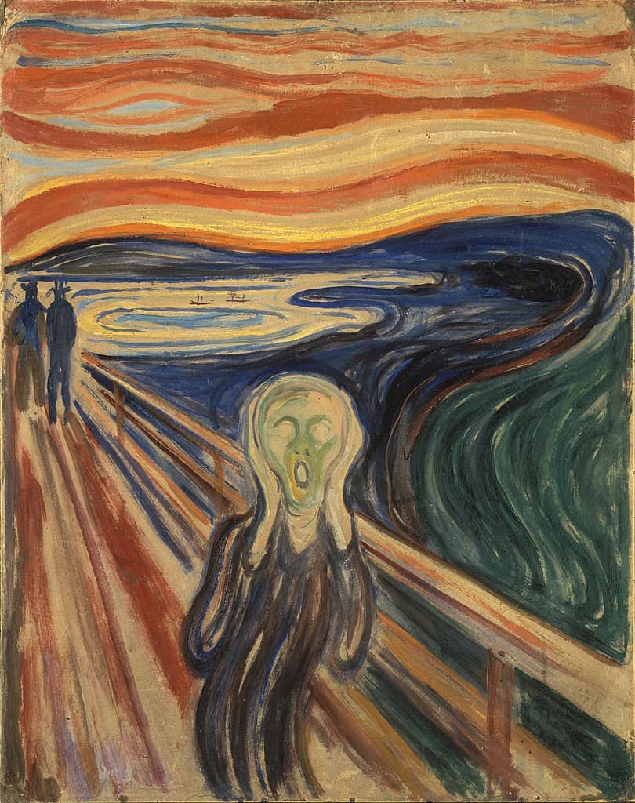
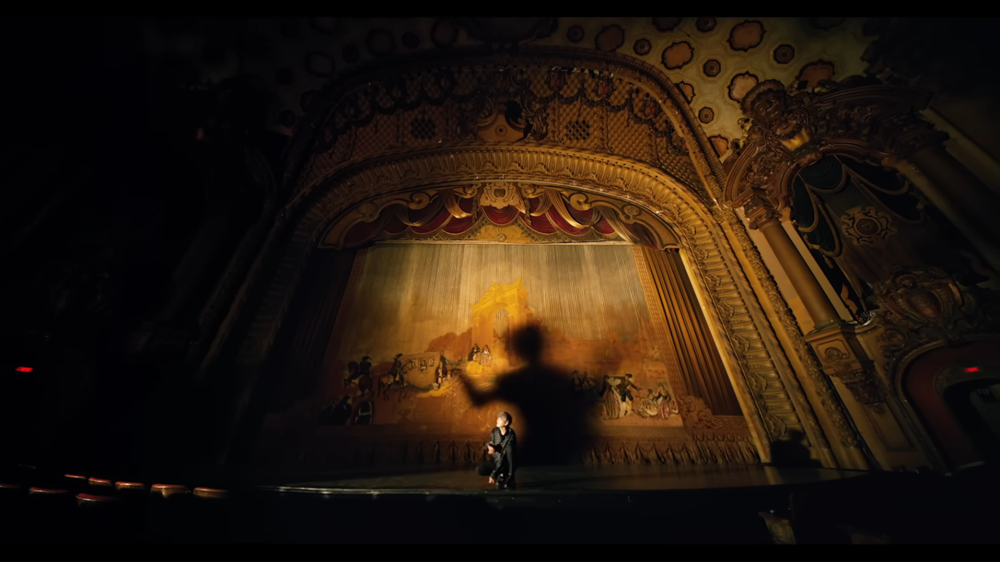
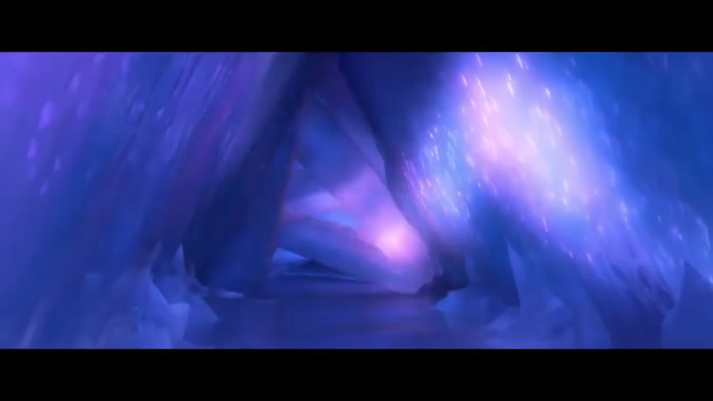
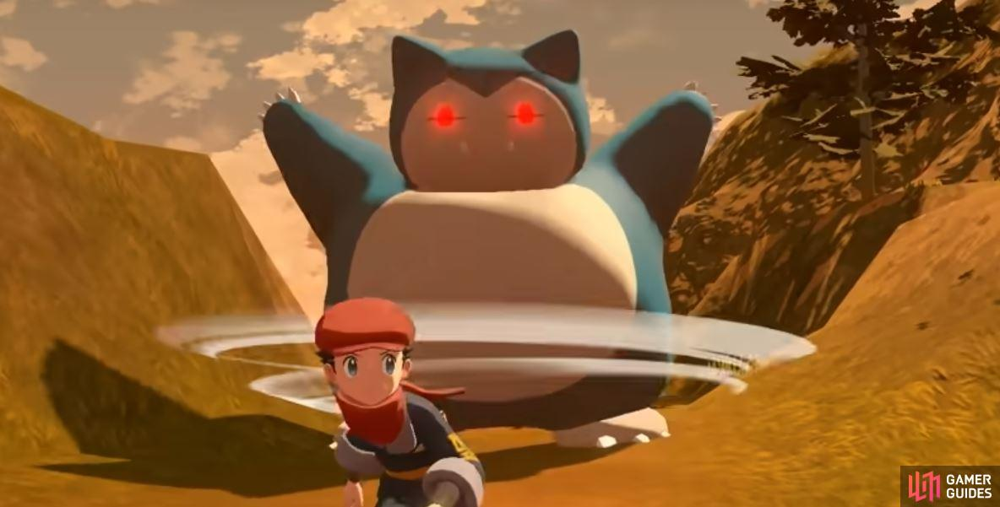
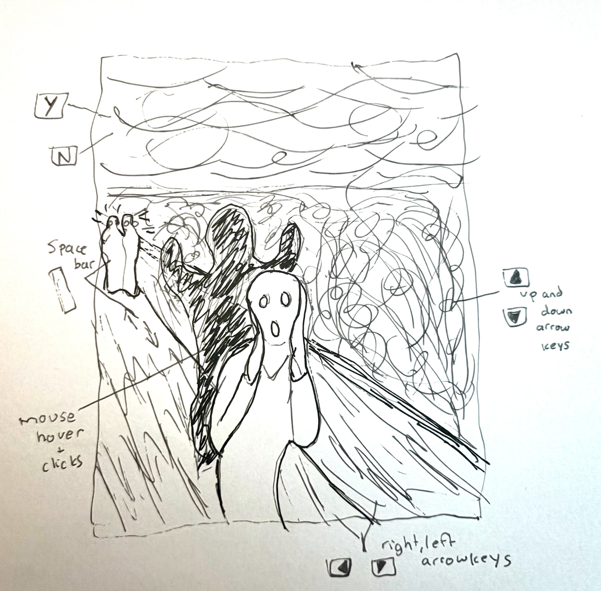
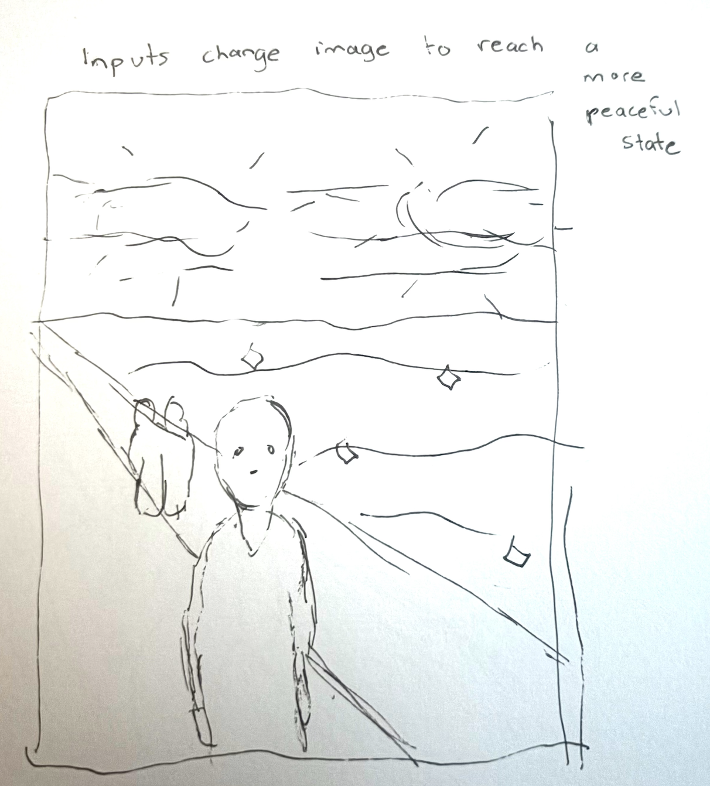

# Quiz 9

## Part 1: Project Direction

The artwork I am reinterpreting is [__*“The Scream”*__ by Edvard Munch](https://www.edvardmunch.org/the-scream.jsp). My idea is to make it an __interactive challenge__ for users. Because “The Scream” presents a figure in a kind of __emotional turmoil__, my idea is for the user to __balance elements__ of the artwork such as the sky, the water, bridge, etc., using __mouse and keyboard inputs__, in order for the screaming figure to find an __emotional balance__ as well.

__Visual ideas and their inspirations include:__

- Unnerving __glowing red eyes appearing on the shadowy figures__ in the background, inspired by a video game, [Pokemon Legends Acreus](https://www.gamerguides.com/pokemon-legends-arceus/guide/gameplay/whats-new/what-are-alpha-pokemon). 
- __Glowing ‘crystallisation' effect of water and background figures__, inspired by an anime: [Pokemon Horizons](https://screenrant.com/pokemon-horizons-scarlet-violet-terastallize-mechanic/), and film: [Frozen II](https://youtu.be/Ex0h7s56iuk?si=yL66aI5udoft08rh). 
- A __‘shadow’ of the main screaming figure__ animated in somewhat unsettling ways while the central figure stays still. This is inspired from a music video, [BTS Black Swan](https://youtu.be/0lapF4DQPKQ?si=0rNiR_pAD1CaZAzd).

__*'The Scream'* by Edvard Munch__

__Moving shadow in BTS Black Swan MV__

__Glowing environment in Frozen II__

__Crystallised figure in Pokemon Horizons__

__Glowed red eyed figure in Pokemon Legends Arceus__

## Part 2: Mechanics

The mechanic my reinterpreted artwork will use is user interaction.
By using the arrows keys, space bar, Y and N keys, as well as mouse hover and mouse clicks, the user will be able to influence the artwork’s visual elements, with the goal of balancing them out. So for example, if the sky is appearing stormy then the user will be able to use the Y and N keys to change its intensity, but this will also impact the intensity of other visuals such as the water, the bridge, and the figures in the background. The user will be able to use the other inputs to influence these other visuals, with the goal of creating a balanced scene which will influence the scream figure’s expression to be a more placid one, rather than a screaming one.

__Sketch 1__

__Sketch 2__

## Part 3: Putting It Together

As I am completing this project individually (utilising one mechanic) I will explain the cohesion of the artwork more generally rather than as a cohesion of mechanics. Essentially, what will hold the artwork together will be that every action is tied to the central scream figure’s expression. Conceptually, the reinterpreted work is about achieving emotional balance for the figure, and the user is able to work towards that through every interaction they have with the work. Visually, the work will be very interconnected because when the user interacts with one visual element it will inadvertently also affect other elements.